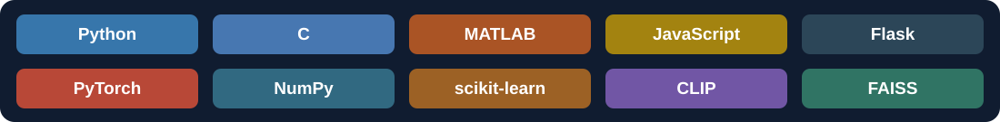
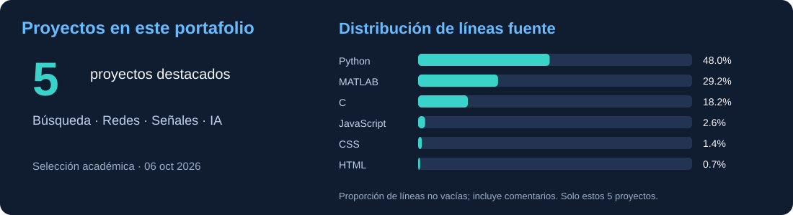

<h1 align="center">Hola 👋, soy Anthony Reinoso</h1>

<strong>Recuperación de información · Redes · Procesamiento de señales · Aprendizaje automático</strong>

Este espacio reúne mis proyectos académicos realizados en el contexto de la **Escuela Politécnica Nacional**. Me interesa convertir ideas en programas que se puedan explorar y probar: desde buscadores por texto e imagen hasta clientes de red y modelos para señales.

<a href="https://github.com/TAnthonyR?tab=repositories">Explorar repositorios</a> · <a href="#proyectos-destacados">Ver proyectos</a>

## Tecnologías utilizadas

Python, C, MATLAB y JavaScript para la implementación; Flask para interfaces de búsqueda; PyTorch, NumPy, scikit-learn, CLIP y FAISS para los modelos y el procesamiento. El cliente FTP utiliza sockets y procesos POSIX en Linux.

## Proyectos destacados

| Proyecto | Qué hace | Tecnologías |
|---|---|---|
| 🔎 **[Proyecto — Buscador TF-IDF y BM25](https://github.com/TAnthonyR/Proyecto-Buscador-TF-IDF-BM25)** | Ordena documentos por relevancia y compara dos métodos de recuperación. | Python · Flask · scikit-learn |
| 🃏 **[Proyecto — Buscador de cartas Yu-Gi-Oh!](https://github.com/TAnthonyR/Proyecto-Buscador-de-cartas-Yu-Gi-Oh)** | Encuentra cartas por texto e imagen en una interfaz web. | Python · CLIP · FAISS · JavaScript |
| 🌐 **[Proyecto — Cliente FTP concurrente](https://github.com/TAnthonyR/Proyecto-Cliente-FTP-Concurrente)** | Transfiere archivos mediante sockets y procesos hijos. | C · POSIX · Linux |
| 🎧 **[Proyecto — Sonido 3D con HRTF](https://github.com/TAnthonyR/Proyecto-Sonido-3D-HRTF)** | Procesa audio para simular una fuente alrededor del oyente. | MATLAB · HRIR · Convolución |
| 🧠 **[Proyecto — Interpolador de señales con RNA](https://github.com/TAnthonyR/Proyecto-Interpolador-de-Senales-RNA)** | Predice señales a partir de coordenadas espaciales. | Python · PyTorch · NumPy |

Cada README incluye **objetivo, estructura, requisitos y pasos de ejecución**. Los conjuntos de datos y modelos pesados se descargan o generan localmente. Los trabajos grupales y los recursos externos conservan sus créditos.

## El portafolio en cifras

La distribución cuenta líneas no vacías de archivos fuente, incluyendo comentarios, en estos cinco proyectos. Es una fotografía de la selección al 6 de octubre de 2026; no representa toda mi actividad en GitHub ni un nivel de dominio de cada tecnología.

---

Gracias por visitar mi portafolio. Puedes explorar el código, los experimentos y sus instrucciones desde cada proyecto.

